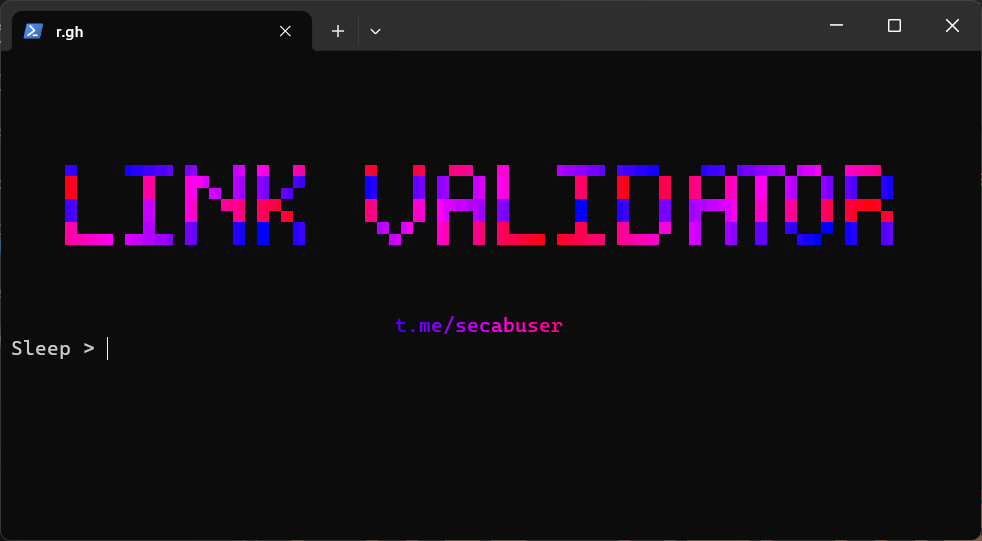

# 💎 Telegram Private Link Generator & Validator



---

## Features

- Generate random private Telegram group/channel links.
- Validate which links are active (based on member count).
- Extract and save valid links along with member count and channel/group name.
- Multi-threaded and fast.

---

## 🛠 How to Use

### Step 1: Generate Links

1. Run `gen.py` using Python **OR** simply double-click `start.bat` and select `Generate`.
2. Enter the number of random links you'd like to create.
3. All generated links will be saved to `link.txt`.

### Step 2: Validate Links

1. Once you have generated links, run `valid.py` **OR** use `start.bat` and select `Validate`.
2. Input the desired **delay (sleep)** and **max threads** for the validation.
3. The tool will check each link:
   - Valid links will be saved in `valid.txt` along with group/channel name and member count.
   - Invalid links will be saved in `invalid.txt`.

---

## Installation

### Option 1: One-Click Setup (Windows Only)

Just run:

```bat
start.bat
